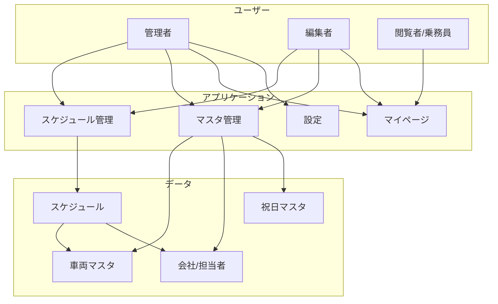

# 観光バス予約管理システム (SanshoTourist)

観光バスの予約、車両、乗務員のスケジュールを一元管理する Web アプリケーションです。
ガントチャート形式のスケジュール表を中心に、効率的な配車管理と情報の共有を実現します。

## システム概要図



## ドキュメント一覧

### 技術ドキュメント（開発者向け）

| ドキュメント                                   | 説明                                                   |
| ---------------------------------------------- | ------------------------------------------------------ |
| [architecture.md](./architecture.md)           | システムアーキテクチャ、技術スタック、ディレクトリ構造 |
| [data-model.md](./data-model.md)               | Prisma スキーマ、ER 図、データモデル詳細               |
| [features.md](./features.md)                   | 実装済み機能の詳細、画面フロー                         |
| [api.md](./api.md)                             | Server Actions 一覧、API 仕様                          |
| [requirement-draft.md](./requirement-draft.md) | 要件定義書（参照用）                                   |

### ユーザーマニュアル（エンドユーザー向け）

| マニュアル                                 | 説明                                             |
| ------------------------------------------ | ------------------------------------------------ |
| [user-manual.md](./user-manual.md)         | システム全体の操作ガイド、ログイン方法、FAQ      |
| [manual-master.md](./manual-master.md)     | マスタ管理（車両・会社・担当者・祝日）の操作方法 |
| [manual-schedule.md](./manual-schedule.md) | スケジュール管理、コピー機能の操作方法           |
| [manual-mypage.md](./manual-mypage.md)     | マイページ（週間/月間ビュー）の使い方            |
| [manual-settings.md](./manual-settings.md) | 公開範囲設定、管理者設定                         |

## クイックスタート

### 前提条件

- Node.js 18 以上
- PostgreSQL データベース
- 認証設定（NextAuth）

### 開発環境の起動

```bash
# 依存関係のインストール
npm install

# Prisma クライアント生成
npx prisma generate

# 開発サーバー起動
npm run dev
```

### アクセス URL

- スケジュール管理: `/sanshoTourist/schedule`
- マスタ管理: `/sanshoTourist/master`
- マイページ: `/sanshoTourist/myPage`
- 設定: `/sanshoTourist/settings`

## 主要機能

### 1. スケジュール管理（メイン機能）

- 車両 × 日付のガントチャート形式で月間スケジュールを表示
- スケジュールの新規作成・編集・削除
- コピー機能による一括複製
- 点呼者の設定

### 2. マスタ管理

- 車両マスタ（プレート No.、車種、座席数など）
- 会社マスタ（顧客会社情報）
- 担当者マスタ（会社に紐づく担当者）
- 祝日マスタ（カレンダー表示用）

### 3. マイページ（乗務員向け）

- 自身のスケジュール確認
- 週間ビュー / 月間ビュー切り替え

### 4. 公開範囲設定（管理者のみ）

- スケジュールの公開終了日を設定
- 設定日以降は管理者以外に非表示

## 権限一覧

| 権限   | スケジュール     | マスタ           | 設定   | マイページ |
| ------ | ---------------- | ---------------- | ------ | ---------- |
| 管理者 | 全操作可         | 全操作可         | 変更可 | 閲覧可     |
| 編集者 | 作成・編集・削除 | 作成・編集・削除 | -      | 閲覧可     |
| 閲覧者 | 閲覧のみ         | 閲覧のみ         | -      | 閲覧可     |

## 技術スタック

- **フロントエンド**: Next.js 15 (App Router), React 18, Tailwind CSS
- **バックエンド**: Next.js Server Actions
- **データベース**: PostgreSQL + Prisma ORM
- **認証**: NextAuth.js
- **状態管理**: SWR, React Hooks

## ディレクトリ構造

```
src/app/(apps)/sanshoTourist/
├── (builders)/          # ビルダークラス
├── (components)/        # UIコンポーネント
│   ├── ScheduleGrid/    # スケジュール表示
│   └── MyPageViews/     # マイページビュー
├── (hooks)/             # カスタムフック
├── (pages)/             # ページコンポーネント
│   ├── schedule/        # スケジュール管理
│   ├── master/          # マスタ管理
│   ├── myPage/          # マイページ
│   └── settings/        # 設定
├── (server-actions)/    # Server Actions
└── docs/                # ドキュメント
```

## 関連リソース

- [Prisma スキーマ](/prisma/schema/sanshoTourist.prisma)
- [共通コンポーネント](/src/cm/components/)
