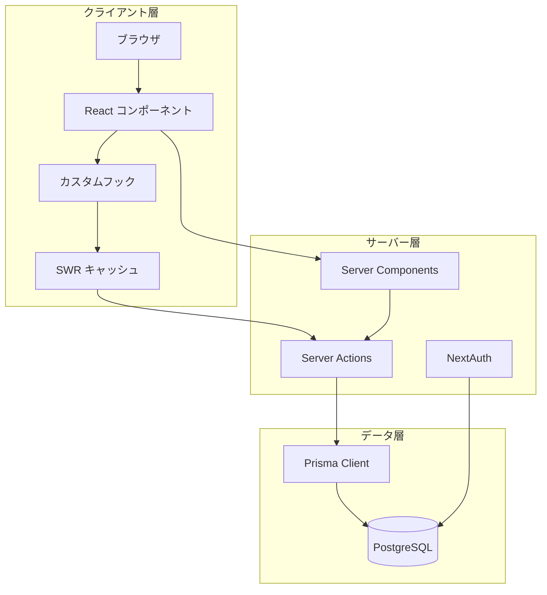
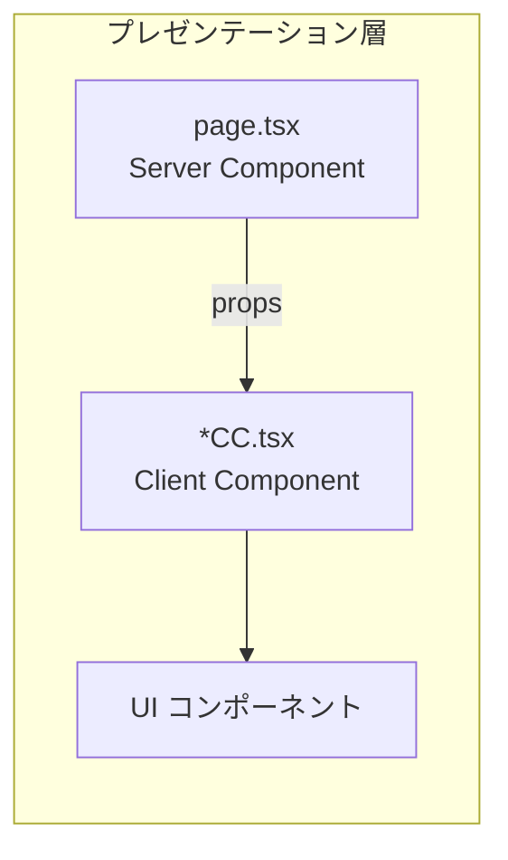
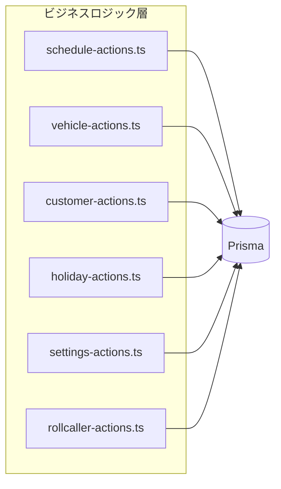
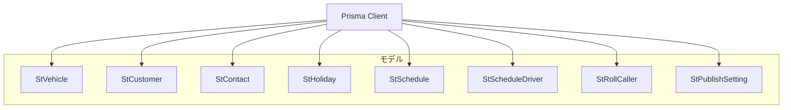
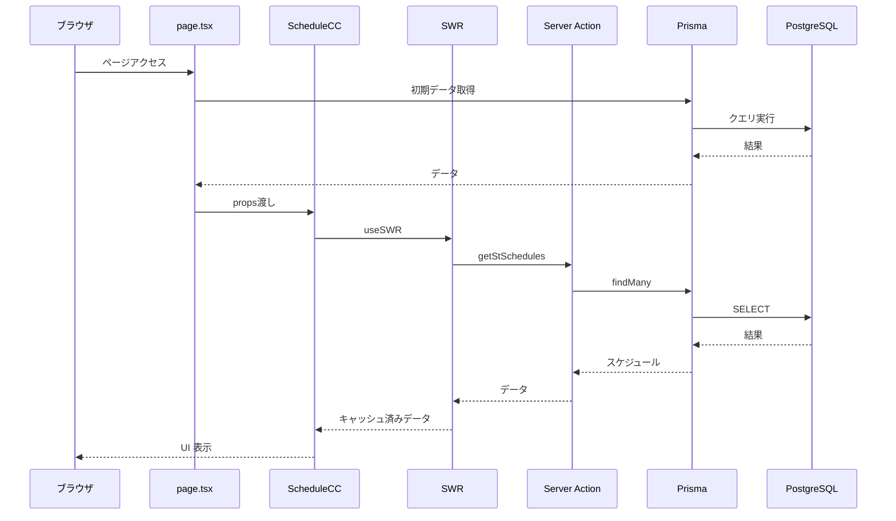
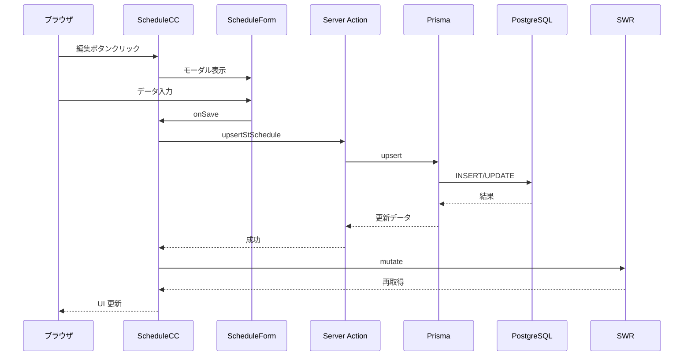
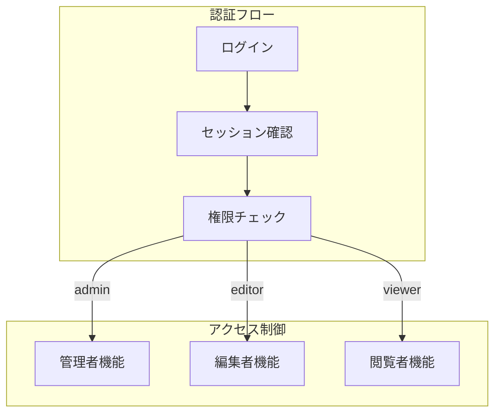

# システムアーキテクチャ

[← README に戻る](./README.md)

## 関連ドキュメント

- [データモデル](./data-model.md)
- [機能詳細](./features.md)
- [API 仕様](./api.md)

---

## 技術スタック

| カテゴリ       | 技術                 | バージョン |
| -------------- | -------------------- | ---------- |
| フレームワーク | Next.js (App Router) | 15.x       |
| UI ライブラリ  | React                | 18.x       |
| スタイリング   | Tailwind CSS         | 4.x        |
| ORM            | Prisma               | 7.x        |
| データベース   | PostgreSQL           | -          |
| 認証           | NextAuth.js          | 4.x        |
| 状態管理       | SWR                  | 2.x        |
| アイコン       | Lucide React         | -          |

## アーキテクチャ概要



## レイヤー構成

### 1. プレゼンテーション層

ユーザーインターフェースを担当するレイヤーです。



- **Server Components (page.tsx)**: 初期データ取得、認証チェック
- **Client Components (\*CC.tsx)**: インタラクティブな UI 制御
- **UI コンポーネント**: 再利用可能な UI パーツ

### 2. ビジネスロジック層

Server Actions によるデータ操作を担当します。



### 3. データアクセス層

Prisma ORM を使用したデータベースアクセスを担当します。



## ディレクトリ構造詳細

```
src/app/(apps)/sanshoTourist/
│
├── (builders)/                    # ビルダークラス
│   ├── ColBuilder.tsx             # カラム定義
│   ├── ModelBuilder.tsx           # モデル設定
│   ├── PageBuilder.tsx            # ページ設定
│   ├── QueryBuilder.tsx           # クエリ設定
│   └── ViewParamBuilder.tsx       # 表示パラメータ
│
├── (components)/                  # UIコンポーネント
│   ├── CopyModeController.tsx     # コピーモード制御
│   ├── ScheduleForm.tsx           # スケジュール入力フォーム
│   ├── ScheduleGrid/              # スケジュールグリッド
│   │   ├── ScheduleGrid.tsx       # メインコンポーネント
│   │   ├── ScheduleGridHeader.tsx # ヘッダー（日付、点呼者）
│   │   ├── ScheduleGridBody.tsx   # ボディ（車両×日付）
│   │   └── ScheduleBar.tsx        # スケジュールバー
│   └── MyPageViews/               # マイページビュー
│       ├── WeeklyView.tsx         # 週間ビュー
│       └── MonthlyView.tsx        # 月間ビュー
│
├── (hooks)/                       # カスタムフック
│   ├── useCopyMode.tsx            # コピーモード管理
│   └── useScheduleGrid.tsx        # グリッド操作
│
├── (pages)/                       # ページ
│   ├── layout.tsx                 # 共通レイアウト
│   ├── template.tsx               # テンプレート
│   ├── page.tsx                   # トップページ
│   ├── schedule/                  # スケジュール管理
│   │   ├── page.tsx               # Server Component
│   │   └── ScheduleCC.tsx         # Client Component
│   ├── master/                    # マスタ管理
│   │   ├── page.tsx
│   │   └── MasterCC.tsx
│   ├── myPage/                    # マイページ
│   │   ├── page.tsx
│   │   └── MyPageCC.tsx
│   ├── settings/                  # 設定
│   │   ├── page.tsx
│   │   └── SettingsCC.tsx
│   └── [dataModelName]/           # 汎用CRUD
│       ├── page.tsx
│       └── [id]/page.tsx
│
├── (server-actions)/              # Server Actions
│   ├── schedule-actions.ts        # スケジュール操作
│   ├── vehicle-actions.ts         # 車両操作
│   ├── customer-actions.ts        # 会社・担当者操作
│   ├── holiday-actions.ts         # 祝日操作
│   ├── rollcaller-actions.ts      # 点呼者操作
│   ├── settings-actions.ts        # 設定操作
│   └── driver-actions.ts          # 乗務員操作
│
└── docs/                          # ドキュメント
    ├── README.md
    ├── architecture.md
    ├── data-model.md
    ├── features.md
    ├── api.md
    └── ...
```

## データフロー

### スケジュール取得フロー



### スケジュール更新フロー



## 認証フロー



## キャッシュ戦略

SWR を使用したクライアントサイドキャッシュ：

```typescript
// スケジュールデータのキャッシュキー
;['stSchedules', startDate.toISOString(), endDate.toISOString()][
  // 点呼者データのキャッシュキー
  ('stRollCallers', startDate.toISOString(), endDate.toISOString())
]

// マスタデータのキャッシュキー
;('stVehicles')
;('stCustomers')
;('stHolidays')
```

- **自動再検証**: フォーカス時、再接続時
- **楽観的更新**: mutate による即時反映
- **エラーリトライ**: 自動リトライ機能

## パフォーマンス最適化

1. **Server Components**: 初期データをサーバーサイドで取得
2. **SWR キャッシュ**: クライアントサイドでのデータキャッシュ
3. **メモ化**: useMemo, useCallback による再計算防止
4. **遅延読み込み**: 必要時のみデータ取得

---

[← README に戻る](./README.md) | [データモデル →](./data-model.md)
