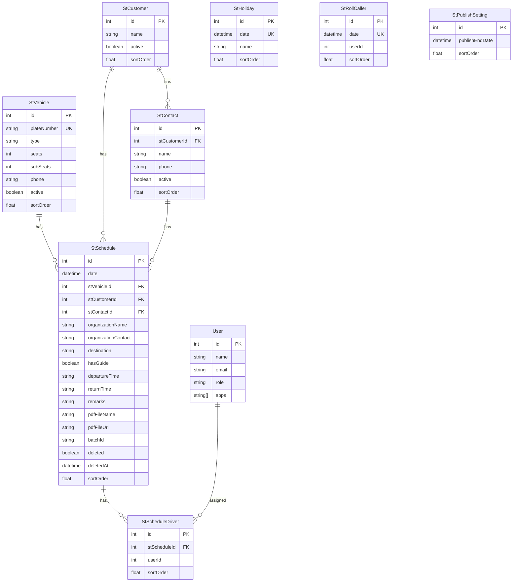

# データモデル

[← README に戻る](./README.md) | [← アーキテクチャ](./architecture.md)

## 関連ドキュメント

- [機能詳細](./features.md)
- [API 仕様](./api.md)

---

## ER 図



## モデル詳細

### StVehicle（車両マスタ）

車両情報を管理するマスタテーブルです。

| カラム      | 型       | 必須 | 説明                             |
| ----------- | -------- | ---- | -------------------------------- |
| id          | Int      | ○    | 主キー（自動採番）               |
| plateNumber | String   | ○    | プレート No.（ユニーク）         |
| type        | String   | -    | 車種（大型、中型、マイクロなど） |
| seats       | Int      | ○    | 正席数（デフォルト: 0）          |
| subSeats    | Int      | ○    | 補助席数（デフォルト: 0）        |
| phone       | String   | -    | 車両携帯番号                     |
| active      | Boolean  | ○    | 有効フラグ（デフォルト: true）   |
| sortOrder   | Float    | ○    | 並び順（デフォルト: 0）          |
| createdAt   | DateTime | ○    | 作成日時                         |
| updatedAt   | DateTime | -    | 更新日時                         |

**リレーション:**

- `StSchedule[]`: この車両に紐づくスケジュール

---

### StCustomer（会社マスタ）

顧客会社情報を管理するマスタテーブルです。

| カラム    | 型       | 必須 | 説明                           |
| --------- | -------- | ---- | ------------------------------ |
| id        | Int      | ○    | 主キー（自動採番）             |
| name      | String   | ○    | 会社名                         |
| active    | Boolean  | ○    | 有効フラグ（デフォルト: true） |
| sortOrder | Float    | ○    | 並び順（デフォルト: 0）        |
| createdAt | DateTime | ○    | 作成日時                       |
| updatedAt | DateTime | -    | 更新日時                       |

**リレーション:**

- `StContact[]`: この会社に紐づく担当者
- `StSchedule[]`: この会社に紐づくスケジュール

---

### StContact（担当者マスタ）

会社に紐づく担当者情報を管理するマスタテーブルです。

| カラム       | 型       | 必須 | 説明                           |
| ------------ | -------- | ---- | ------------------------------ |
| id           | Int      | ○    | 主キー（自動採番）             |
| stCustomerId | Int      | ○    | 会社 ID（外部キー）            |
| name         | String   | ○    | 担当者名                       |
| phone        | String   | -    | 電話番号                       |
| active       | Boolean  | ○    | 有効フラグ（デフォルト: true） |
| sortOrder    | Float    | ○    | 並び順（デフォルト: 0）        |
| createdAt    | DateTime | ○    | 作成日時                       |
| updatedAt    | DateTime | -    | 更新日時                       |

**リレーション:**

- `StCustomer`: 所属会社（Cascade 削除）
- `StSchedule[]`: この担当者に紐づくスケジュール

---

### StHoliday（祝日マスタ）

祝日情報を管理するマスタテーブルです。カレンダー表示に使用されます。

| カラム    | 型       | 必須 | 説明                           |
| --------- | -------- | ---- | ------------------------------ |
| id        | Int      | ○    | 主キー（自動採番）             |
| date      | DateTime | ○    | 日付（ユニーク、UTC 00:00:00） |
| name      | String   | ○    | 祝日名                         |
| sortOrder | Float    | ○    | 並び順（デフォルト: 0）        |
| createdAt | DateTime | ○    | 作成日時                       |
| updatedAt | DateTime | -    | 更新日時                       |

---

### StSchedule（スケジュール）

運行スケジュールを管理するメインテーブルです。

| カラム              | 型       | 必須 | 説明                                |
| ------------------- | -------- | ---- | ----------------------------------- |
| id                  | Int      | ○    | 主キー（自動採番）                  |
| date                | DateTime | ○    | 運行日（UTC 00:00:00）              |
| stVehicleId         | Int      | -    | 車両 ID（外部キー）                 |
| stCustomerId        | Int      | -    | 会社 ID（外部キー）                 |
| stContactId         | Int      | -    | 担当者 ID（外部キー）               |
| organizationName    | String   | -    | 団体名                              |
| organizationContact | String   | -    | 担当者名（手入力）                  |
| destination         | String   | -    | 行き先                              |
| hasGuide            | Boolean  | ○    | ガイドの有無（デフォルト: false）   |
| departureTime       | String   | -    | 出庫時間（HH:mm）                   |
| returnTime          | String   | -    | 帰庫時間（HH:mm）                   |
| remarks             | String   | -    | 備考                                |
| pdfFileName         | String   | -    | 運行指示書ファイル名                |
| pdfFileUrl          | String   | -    | 運行指示書ファイル URL              |
| batchId             | String   | -    | 一括登録 ID                         |
| deleted             | Boolean  | ○    | 論理削除フラグ（デフォルト: false） |
| deletedAt           | DateTime | -    | 削除日時                            |
| sortOrder           | Float    | ○    | 並び順（デフォルト: 0）             |
| createdAt           | DateTime | ○    | 作成日時                            |
| updatedAt           | DateTime | -    | 更新日時                            |

**リレーション:**

- `StVehicle`: 車両（SetNull 削除）
- `StCustomer`: 会社（SetNull 削除）
- `StContact`: 担当者（SetNull 削除）
- `StScheduleDriver[]`: 乗務員

---

### StScheduleDriver（スケジュール-乗務員 中間テーブル）

スケジュールと乗務員の多対多関係を管理する中間テーブルです。

| カラム       | 型       | 必須 | 説明                            |
| ------------ | -------- | ---- | ------------------------------- |
| id           | Int      | ○    | 主キー（自動採番）              |
| stScheduleId | Int      | ○    | スケジュール ID（外部キー）     |
| userId       | Int      | ○    | ユーザー ID（アプリレベル参照） |
| sortOrder    | Float    | ○    | 並び順（デフォルト: 0）         |
| createdAt    | DateTime | ○    | 作成日時                        |
| updatedAt    | DateTime | -    | 更新日時                        |

**ユニーク制約:** `stScheduleId` + `userId`

**リレーション:**

- `StSchedule`: スケジュール（Cascade 削除）

---

### StRollCaller（点呼者）

日付ごとの点呼者を管理するテーブルです。

| カラム    | 型       | 必須 | 説明                            |
| --------- | -------- | ---- | ------------------------------- |
| id        | Int      | ○    | 主キー（自動採番）              |
| date      | DateTime | ○    | 日付（ユニーク、UTC 00:00:00）  |
| userId    | Int      | ○    | ユーザー ID（アプリレベル参照） |
| sortOrder | Float    | ○    | 並び順（デフォルト: 0）         |
| createdAt | DateTime | ○    | 作成日時                        |
| updatedAt | DateTime | -    | 更新日時                        |

---

### StPublishSetting（公開範囲設定）

スケジュールの公開範囲を管理するテーブルです。

| カラム         | 型       | 必須 | 説明                                       |
| -------------- | -------- | ---- | ------------------------------------------ |
| id             | Int      | ○    | 主キー（自動採番）                         |
| publishEndDate | DateTime | -    | 公開終了日（この日以降は管理者以外非表示） |
| sortOrder      | Float    | ○    | 並び順（デフォルト: 0）                    |
| createdAt      | DateTime | ○    | 作成日時                                   |
| updatedAt      | DateTime | -    | 更新日時                                   |

---

### User（ユーザー）※共通テーブル

システム全体で使用するユーザーテーブルです。`apps` 配列に `'sanshoTourist'` を持つユーザーがこのアプリの利用者となります。

| カラム | 型       | 必須 | 説明                          |
| ------ | -------- | ---- | ----------------------------- |
| id     | Int      | ○    | 主キー                        |
| name   | String   | ○    | 氏名                          |
| email  | String   | -    | メールアドレス                |
| role   | String   | ○    | ロール（admin, editor, user） |
| apps   | String[] | -    | 利用可能アプリ一覧            |
| ...    | ...      | ...  | その他の共通フィールド        |

## 日付の取り扱い

### UTC 変換

すべての日付データは UTC 00:00:00 として保存されます。

```typescript
// フォーム入力からローカル日付を作成
const parseLocalDate = (dateStr: string): Date => {
  const [year, month, day] = dateStr.split('-').map(Number)
  return new Date(year, month - 1, day, 0, 0, 0)
}

// UTC に変換して保存
const utcDate = toUtc(date) // Server Action 内で変換
```

### JST 表示

表示時は JST に変換して表示します。

```typescript
// DB からの UTC 日付を JST 表示用に変換
const toJstForDisplay = (date: Date): Date => {
  const dt = new Date(date)
  dt.setHours(dt.getHours() + 9)
  return dt
}
```

## 論理削除

スケジュールデータは論理削除をサポートしています。

```typescript
// 論理削除
await prisma.stSchedule.update({
  where: {id},
  data: {
    deleted: true,
    deletedAt: new Date(),
  },
})

// 取得時は deleted: false でフィルタ
await prisma.stSchedule.findMany({
  where: {deleted: false},
})
```

---

[← アーキテクチャ](./architecture.md) | [機能詳細 →](./features.md)
