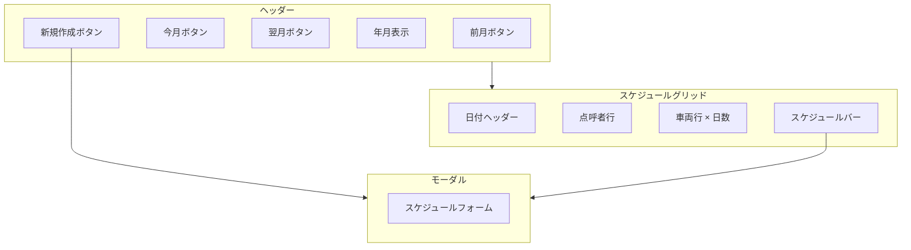
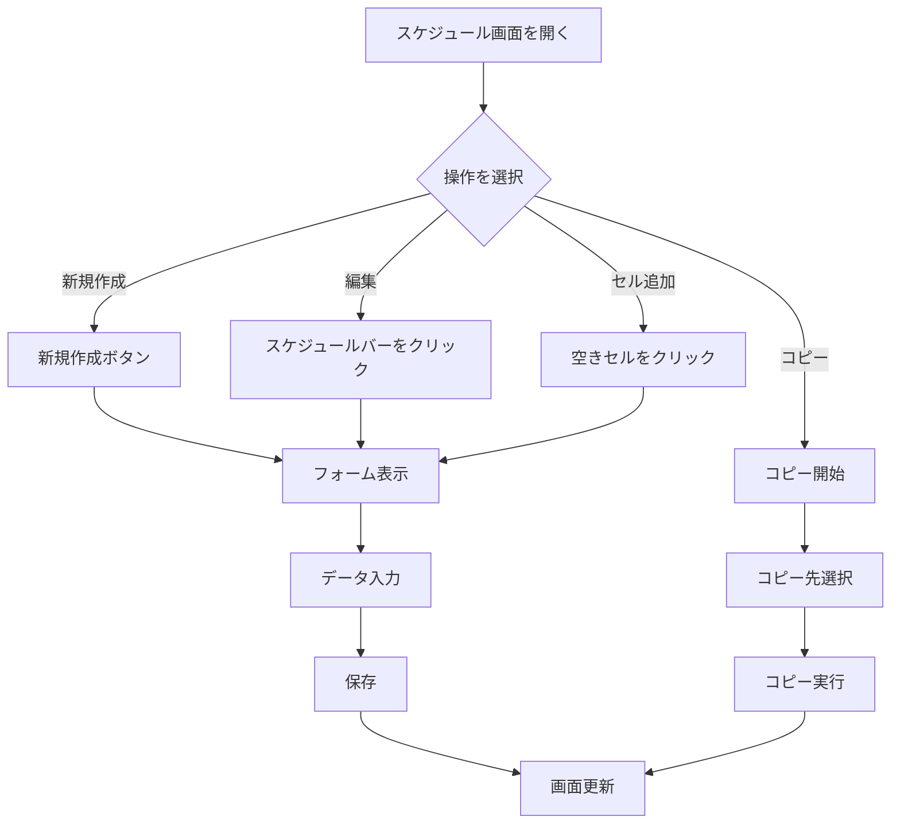
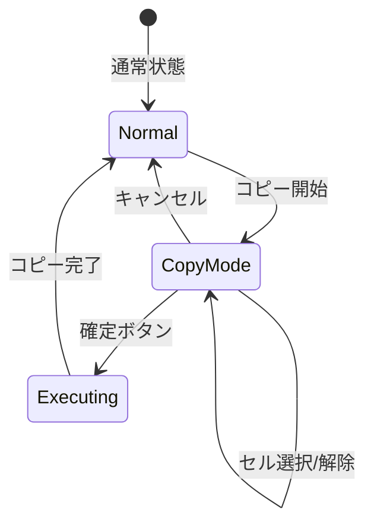
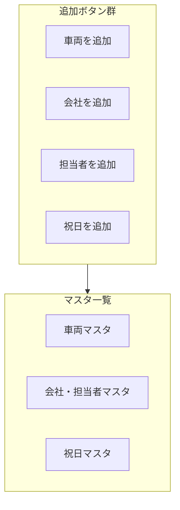
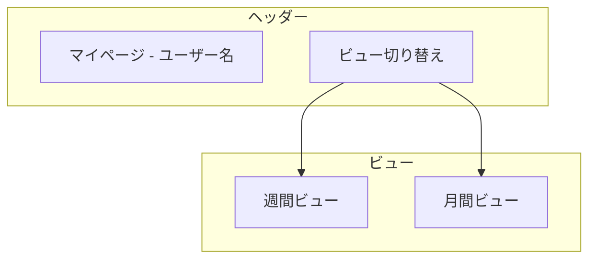
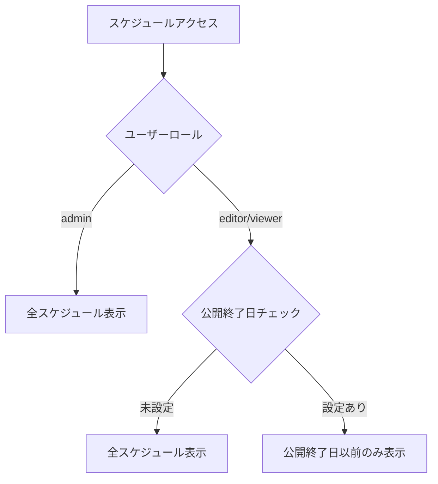

# 機能詳細

[← README に戻る](./README.md) | [← データモデル](./data-model.md)

## 関連ドキュメント

- [API 仕様](./api.md)
- [スケジュール管理マニュアル](./manual-schedule.md)
- [マスタ管理マニュアル](./manual-master.md)

---

## 実装状況サマリ

| 機能              | ステータス          | 優先度 |
| ----------------- | ------------------- | ------ |
| スケジュール管理  | ✅ 実装済み         | 高     |
| マスタ管理        | ✅ 実装済み         | 高     |
| コピー機能        | ✅ 実装済み         | 高     |
| マイページ        | ✅ 実装済み         | 高     |
| 公開範囲設定      | ✅ 実装済み         | 中     |
| 点呼者管理        | ✅ 実装済み         | 中     |
| PDF ファイル添付  | ⚠️ スキーマのみ     | 中     |
| 一括登録・削除 UI | ⚠️ バックエンドのみ | 低     |
| CSV 一括登録      | ❌ 未実装           | 低     |

---

## 1. スケジュール管理機能

### 概要

車両 × 日付のガントチャート形式で月間スケジュールを表示・管理する、本システムのメイン機能です。

### 画面構成

### 表示形式

- **縦軸**: 車両（プレート No. 順）
- **横軸**: 日付（月間表示）
- **点呼者行**: 日付ヘッダーの下に、その日の点呼者を表示

### スケジュール登録項目

| 項目           | 種別               | 必須 | 説明               |
| -------------- | ------------------ | ---- | ------------------ |
| 運行日         | 日付選択           | ○    | 運行する日付       |
| 車両           | 選択（マスタ参照） | ○    | 使用する車両       |
| 顧客（会社）   | 選択（マスタ参照） | -    | 顧客会社           |
| 顧客（担当者） | 選択（マスタ参照） | -    | 顧客担当者         |
| 団体名         | テキスト入力       | ○    | 団体名（手入力）   |
| 担当者名       | テキスト入力       | -    | 担当者名（手入力） |
| 行き先         | テキスト入力       | ○    | 目的地             |
| 乗務員         | 複数選択           | ○    | 担当乗務員         |
| ガイドの有無   | チェックボックス   | -    | ガイド同乗の有無   |
| 出庫時間       | 時間入力           | ○    | 出発時刻           |
| 帰庫時間       | 時間入力           | ○    | 帰着予定時刻       |
| 備考           | テキストエリア     | -    | 自由記述欄         |

### 操作フロー

---

## 2. コピー機能

### 概要

既存のスケジュールを複数のセル（車両 × 日付）に一括でコピーする機能です。

### コピーモードフロー

### 操作手順

1. コピー元のスケジュールバーで「コピー」をクリック
2. 画面が暗転し、コピーモードに移行
3. コピー先のセルをクリックして選択（複数選択可）
4. 「コピー実施」ボタンで一括コピー
5. 確認ダイアログで「OK」をクリック

### 制限事項

- 月をまたいでのコピーは不可
- コピー先に既存のスケジュールがある場合は上書きされない（新規追加のみ）

---

## 3. マスタ管理機能

### 概要

車両、会社、担当者、祝日の各マスタデータを管理する機能です。

### 画面構成

### 車両マスタ

| 項目         | 必須 | 説明                         |
| ------------ | ---- | ---------------------------- |
| プレート No. | ○    | 車両のナンバープレート       |
| 車種         | ○    | 大型、中型、小型、マイクロ   |
| 正席数       | ○    | 正席の座席数                 |
| 補助席数     | -    | 補助席の座席数               |
| 車両携帯番号 | -    | 車両に搭載された携帯電話番号 |

### 会社・担当者マスタ

**会社:**
| 項目 | 必須 | 説明 |
|------|------|------|
| 会社名 | ○ | 顧客会社の名称 |

**担当者:**
| 項目 | 必須 | 説明 |
|------|------|------|
| 会社 | ○ | 所属会社（選択） |
| 担当者名 | ○ | 担当者の氏名 |
| 電話番号 | - | 担当者の連絡先 |

### 祝日マスタ

| 項目   | 必須 | 説明       |
| ------ | ---- | ---------- |
| 日付   | ○    | 祝日の日付 |
| 祝日名 | ○    | 祝日の名称 |

---

## 4. マイページ機能

### 概要

ログインした乗務員が自身のスケジュールを確認するための画面です。

### 画面構成

### 週間ビュー

- 今日から 2 週間分のスケジュールをリスト表示
- 日付ごとに縦スクロールで確認

### 月間ビュー

- カレンダー形式で月間スケジュールを表示
- 前月/翌月への移動が可能

### 表示項目

- 日付
- 出庫/帰庫時間
- 行き先
- 団体名
- 車両
- 担当者

---

## 5. 公開範囲設定機能

### 概要

管理者のみがアクセス可能な設定画面で、スケジュールの公開終了日を設定します。

### 動作

- **公開終了日を設定**: 設定日以降のスケジュールは管理者以外に非表示
- **公開終了日を未設定**: すべてのスケジュールが表示される

### 権限フロー

---

## 6. 点呼者管理機能

### 概要

スケジュール画面の日付ヘッダー下に、その日の点呼担当者を表示・設定する機能です。

### 操作

1. 点呼者行のセルをクリック
2. ドロップダウンからユーザーを選択
3. 自動保存

---

## 未実装機能

### PDF ファイル添付機能

**要件:**

- 各スケジュールに PDF ファイル（運行指示書など）を添付可能
- ファイル形式は PDF のみ
- サイズ制限: 1 ファイルあたり 5MB まで

**現状:**

- スキーマに `pdfFileName`, `pdfFileUrl` フィールドは存在
- アップロード UI は未実装

### 一括登録・削除機能

**要件:**

- 指定期間・指定ルール（毎週月曜日など）で同一内容を一括登録
- 一括登録されたデータをまとめて削除

**現状:**

- `batchId` フィールドで一括登録の識別は可能
- `deleteStSchedulesByBatchId` 関数は実装済み
- 一括登録 UI は未実装

### CSV 一括登録機能

**要件:**

- テンプレート CSV をダウンロード
- CSV にデータを入力してアップロード
- システムにデータを取り込み

**現状:**

- 未実装

---

[← データモデル](./data-model.md) | [API 仕様 →](./api.md)
