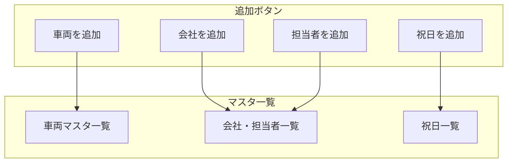

# マスタ管理マニュアル

[← ユーザーマニュアル](./user-manual.md) | [← README](./README.md)

## 関連マニュアル

- [スケジュール管理マニュアル](./manual-schedule.md)
- [マイページマニュアル](./manual-mypage.md)
- [設定マニュアル](./manual-settings.md)

---

## 概要

マスタ管理では、システムで使用する基本データを登録・編集・削除できます。

### 管理できるデータ

| マスタ       | 説明                     |
| ------------ | ------------------------ |
| 車両マスタ   | バスの車両情報           |
| 会社マスタ   | 顧客会社の情報           |
| 担当者マスタ | 会社に紐づく担当者情報   |
| 祝日マスタ   | カレンダーに表示する祝日 |

---

## 画面構成

---

## 車両マスタの管理

### 車両を追加する

#### 操作手順

1. 画面上部の「**車両を追加**」ボタンをクリック
2. フォームに以下の情報を入力

| 項目         | 必須 | 入力例        | 説明                            |
| ------------ | :--: | ------------- | ------------------------------- |
| プレート No. |  ○   | 湘南230あ3409 | ナンバープレートの番号          |
| 車種         |  ○   | 大型          | 大型/中型/小型/マイクロから選択 |
| 正席数       |  ○   | 45            | 正席の座席数                    |
| 補助席数     |  -   | 10            | 補助席の座席数                  |
| 車両携帯番号 |  -   | 090-1234-5678 | 車載電話の番号                  |

3. 「**保存**」ボタンをクリック

### 車両を編集する

1. 車両マスタ一覧から、編集したい車両の「✏️（編集）」ボタンをクリック
2. フォームで内容を修正
3. 「**保存**」ボタンをクリック

### 車両を削除する

1. 車両マスタ一覧から、削除したい車両の「🗑️（削除）」ボタンをクリック
2. 確認ダイアログで「OK」をクリック

> ⚠️ **注意**: 削除した車両に紐づくスケジュールでは、車両情報が空白になります。

---

## 会社マスタの管理

### 会社を追加する

#### 操作手順

1. 画面上部の「**会社を追加**」ボタンをクリック
2. フォームに以下の情報を入力

| 項目   | 必須 | 入力例          | 説明           |
| ------ | :--: | --------------- | -------------- |
| 会社名 |  ○   | 株式会社ABC観光 | 顧客会社の名称 |

3. 「**保存**」ボタンをクリック

### 会社を編集する

1. 会社・担当者一覧から、編集したい会社の「✏️（編集）」ボタンをクリック
2. フォームで会社名を修正
3. 「**保存**」ボタンをクリック

### 会社を削除する

1. 会社・担当者一覧から、削除したい会社の「🗑️（削除）」ボタンをクリック
2. 確認ダイアログで「OK」をクリック

> ⚠️ **注意**: 会社を削除すると、その会社に紐づく**担当者もすべて削除**されます。

---

## 担当者マスタの管理

### 担当者を追加する

#### 操作手順

1. 画面上部の「**担当者を追加**」ボタンをクリック
2. フォームに以下の情報を入力

| 項目     | 必須 | 入力例          | 説明           |
| -------- | :--: | --------------- | -------------- |
| 会社     |  ○   | 株式会社ABC観光 | 所属会社を選択 |
| 担当者名 |  ○   | 山田太郎        | 担当者の氏名   |
| 電話番号 |  -   | 03-1234-5678    | 担当者の連絡先 |

3. 「**保存**」ボタンをクリック

> 💡 **ヒント**: 担当者を追加するには、先に会社を登録しておく必要があります。

### 担当者を編集する

1. 会社・担当者一覧で、該当会社の担当者行にある「✏️（編集）」ボタンをクリック
2. フォームで内容を修正
3. 「**保存**」ボタンをクリック

### 担当者を削除する

1. 会社・担当者一覧で、該当会社の担当者行にある「🗑️（削除）」ボタンをクリック
2. 確認ダイアログで「OK」をクリック

---

## 祝日マスタの管理

### 祝日を追加する

#### 操作手順

1. 画面上部の「**祝日を追加**」ボタンをクリック
2. フォームに以下の情報を入力

| 項目   | 必須 | 入力例     | 説明       |
| ------ | :--: | ---------- | ---------- |
| 日付   |  ○   | 2024-01-01 | 祝日の日付 |
| 祝日名 |  ○   | 元日       | 祝日の名称 |

3. 「**保存**」ボタンをクリック

### 祝日を編集する

1. 祝日一覧から、編集したい祝日の「✏️（編集）」ボタンをクリック
2. フォームで祝日名を修正
3. 「**保存**」ボタンをクリック

> ⚠️ **注意**: 祝日の**日付は変更できません**。日付を変更したい場合は、削除して新規作成してください。

### 祝日を削除する

1. 祝日一覧から、削除したい祝日の「🗑️（削除）」ボタンをクリック
2. 確認ダイアログで「OK」をクリック

---

## よくある質問

### Q. 登録したデータがスケジュール画面に表示されない

マスタデータには「有効フラグ」があり、無効になっているデータは選択肢に表示されません。
データを登録したばかりの場合は、画面をリロード（F5 キー）してみてください。

### Q. 会社を削除したら担当者も消えてしまった

仕様通りの動作です。会社を削除すると、その会社に紐づく担当者も自動的に削除されます。
会社を残したまま担当者だけを削除したい場合は、担当者の「削除」ボタンを使用してください。

### Q. 同じプレート No. の車両を登録できない

プレート No. は一意（ユニーク）である必要があります。
既に登録されているプレート No. と同じ番号は登録できません。

---

## 操作のコツ

1. **マスタは先に登録**: スケジュールを作成する前に、必要な車両・会社・担当者を登録しておきましょう
2. **祝日は年初に登録**: 年間の祝日を年初にまとめて登録しておくと便利です
3. **不要なデータは削除**: 使わなくなった車両や会社は削除して、一覧をすっきりさせましょう

---

[← ユーザーマニュアル](./user-manual.md) | [スケジュール管理マニュアル →](./manual-schedule.md)
