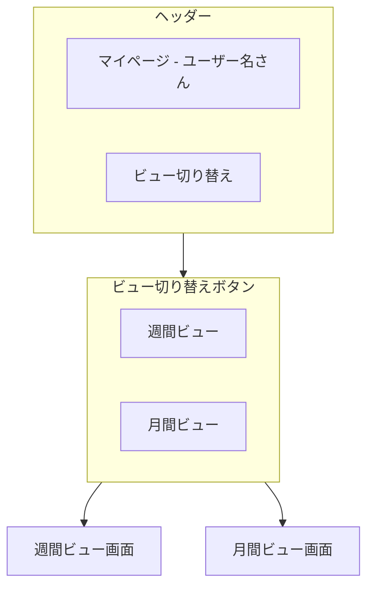
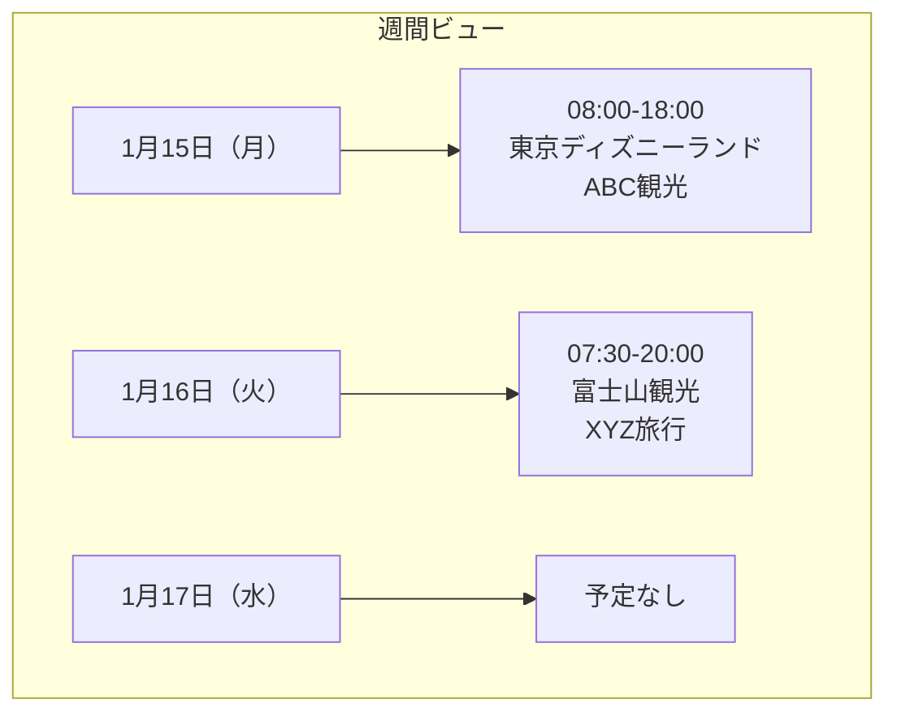

# マイページマニュアル

[← ユーザーマニュアル](./user-manual.md) | [← README](./README.md)

## 関連マニュアル

- [マスタ管理マニュアル](./manual-master.md)
- [スケジュール管理マニュアル](./manual-schedule.md)
- [設定マニュアル](./manual-settings.md)

---

## 概要

マイページでは、自分自身に割り当てられた運行スケジュールを確認できます。
乗務員として登録されているスケジュールのみが表示されます。

---

## 画面構成



---

## ビューの切り替え

マイページには 2 つの表示モードがあります。

| ビュー     | 説明                                              |
| ---------- | ------------------------------------------------- |
| 週間ビュー | 今日から 2 週間分のスケジュールをリスト形式で表示 |
| 月間ビュー | カレンダー形式で月間スケジュールを表示            |

### 切り替え方法

画面上部のボタンで切り替えます。

- 「**週間ビュー**」ボタン: 週間ビューに切り替え
- 「**月間ビュー**」ボタン: 月間ビューに切り替え

---

## 週間ビュー

今日から 2 週間分のスケジュールが日付順にリスト表示されます。



### 表示される情報

| 項目   | 説明               |
| ------ | ------------------ |
| 日付   | 運行日と曜日       |
| 時間   | 出庫時間〜帰庫時間 |
| 行き先 | 目的地             |
| 団体名 | 団体の名称         |
| 車両   | 使用する車両       |

### 特徴

- 予定がある日のみ表示
- 直近の予定が上に表示
- スクロールで 2 週間分を確認可能

---

## 月間ビュー

カレンダー形式で月間のスケジュールを確認できます。

```mermaid
flowchart TB
    subgraph monthly [月間ビュー]
        nav[← 前月 | 2024年1月 | 翌月 →]
        calendar[カレンダー表示]
    end

    nav --> calendar
```

### 月の切り替え

- 「**← 前月**」: 前の月を表示
- 「**翌月 →**」: 次の月を表示

### カレンダーの見方

| 表示         | 説明                       |
| ------------ | -------------------------- |
| 日付         | その日の日付               |
| スケジュール | 予定がある日にはバーが表示 |
| 祝日         | 祝日は色分けで表示         |

---

## スケジュール詳細の確認

### 週間ビューの場合

リストに表示されているスケジュールをクリックすると、詳細情報を確認できます。

### 月間ビューの場合

カレンダー上のスケジュールバーをクリックすると、詳細情報を確認できます。

### 確認できる詳細情報

| 項目     | 説明                         |
| -------- | ---------------------------- |
| 運行日   | 運行する日付                 |
| 車両     | 使用するバス                 |
| 出庫時間 | 出発時刻                     |
| 帰庫時間 | 帰着予定時刻                 |
| 団体名   | 団体の名称                   |
| 行き先   | 目的地                       |
| 担当者   | 顧客側の担当者名             |
| 乗務員   | 担当する乗務員（自分を含む） |
| ガイド   | ガイドの有無                 |
| 備考     | その他の情報                 |

---

## よくある質問

### Q. 自分のスケジュールが表示されない

以下を確認してください：

1. **ログインユーザーの確認**
   - 正しいユーザーでログインしているか確認

2. **乗務員登録の確認**
   - スケジュールに自分が乗務員として登録されているか確認
   - 管理者に確認してもらってください

3. **公開範囲の確認**
   - 将来のスケジュールは公開範囲設定により非表示になっている場合があります
   - 管理者に確認してください

### Q. 週間ビューに何も表示されない

今日から 2 週間以内に予定がない場合、週間ビューには何も表示されません。
月間ビューに切り替えて、他の日程を確認してください。

### Q. 月間ビューで詳細が見づらい

月間ビューはカレンダー形式のため、1 日に複数のスケジュールがあると詰まって表示されます。
週間ビューに切り替えると、リスト形式で見やすく確認できます。

### Q. スケジュールを編集したい

マイページからはスケジュールの編集はできません。
編集が必要な場合は、スケジュール管理画面から行うか、管理者に依頼してください。

---

## 使い方のコツ

### 1. 日々の確認は週間ビュー

直近 2 週間の予定を確認するには、週間ビューが便利です。
出勤前に確認して、当日の予定を把握しましょう。

### 2. 月間の見通しは月間ビュー

月全体の予定を確認するには、月間ビューが便利です。
休みの日や繁忙期の確認に活用できます。

### 3. 詳細は常に確認

スケジュールをクリックして、詳細情報を必ず確認しましょう。
特に以下の点は重要です：

- 出庫時間
- 使用車両
- 行き先
- 備考欄の特記事項

---

## アクセス方法

### URL

```
/sanshoTourist/myPage
```

### ナビゲーションから

メニューの「**マイページ**」をクリック

---

[← スケジュール管理マニュアル](./manual-schedule.md) | [設定マニュアル →](./manual-settings.md)
