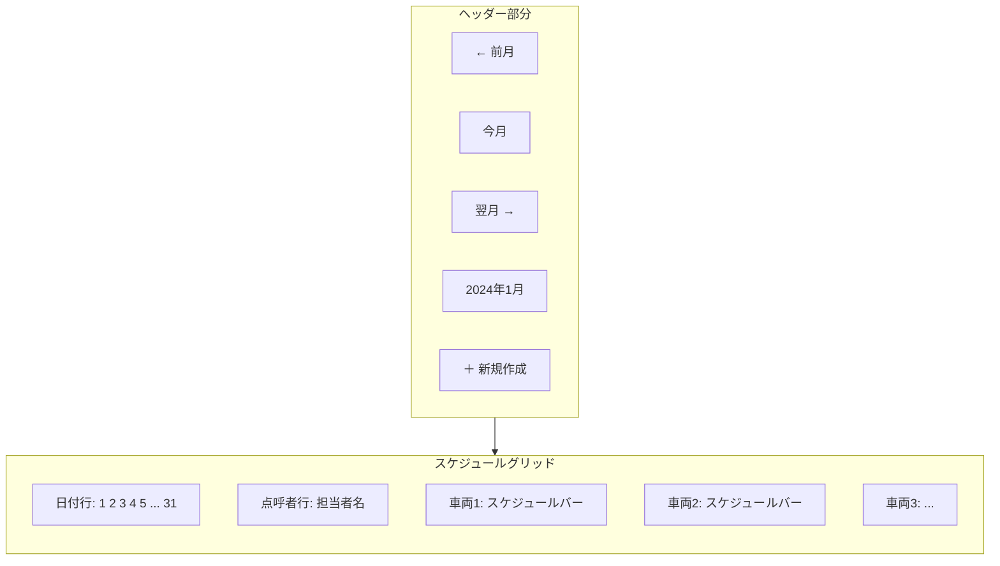
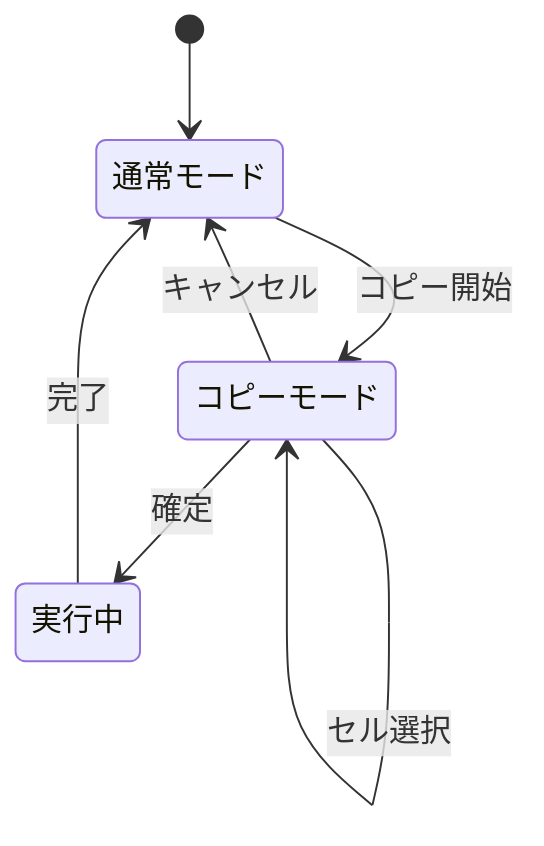

# スケジュール管理マニュアル

[← ユーザーマニュアル](./user-manual.md) | [← README](./README.md)

## 関連マニュアル

- [マスタ管理マニュアル](./manual-master.md)
- [マイページマニュアル](./manual-mypage.md)
- [設定マニュアル](./manual-settings.md)

---

## 概要

スケジュール管理は、本システムのメイン機能です。
車両 × 日付のガントチャート形式で、月間の運行スケジュールを管理できます。

---

## 画面構成

### 各部分の説明

| 部分           | 説明                                       |
| -------------- | ------------------------------------------ |
| 前月/今月/翌月 | 表示する月を切り替え                       |
| 年月表示       | 現在表示中の年月                           |
| 新規作成ボタン | スケジュールを新しく作成                   |
| 日付行         | 横軸に日付を表示（祝日は色分け）           |
| 点呼者行       | その日の点呼担当者を表示                   |
| 車両行         | 縦軸に車両を表示、スケジュールをバーで表示 |

---

## スケジュールの新規作成

### 方法1: 新規作成ボタンから作成

1. 画面右上の「**＋ 新規作成**」ボタンをクリック
2. フォームに必要な情報を入力
3. 「**保存**」ボタンをクリック

### 方法2: セルから作成

1. グリッドの空きセル（車両と日付の交点）をクリック
2. フォームが表示される（車両と日付は自動入力）
3. その他の情報を入力
4. 「**保存**」ボタンをクリック

### 入力項目

| 項目           | 必須 | 説明                                         |
| -------------- | :--: | -------------------------------------------- |
| 運行日         |  ○   | 運行する日付                                 |
| 車両           |  ○   | 使用する車両を選択                           |
| 出庫時間       |  ○   | 出発時刻（例: 08:00）                        |
| 帰庫時間       |  ○   | 帰着予定時刻（例: 18:00）                    |
| 顧客（会社）   |  -   | 顧客会社を選択（選択すると団体名に自動入力） |
| 顧客（担当者） |  -   | 顧客担当者を選択                             |
| 団体名         |  ○   | 団体の名称（手入力可）                       |
| 担当者名       |  -   | 担当者の名前（手入力可）                     |
| 行き先         |  ○   | 目的地                                       |
| 乗務員         |  ○   | 担当する乗務員を選択（複数選択可）           |
| ガイドの有無   |  -   | ガイドが同乗するかチェック                   |
| 備考           |  -   | 自由記述欄                                   |

> 💡 **ヒント**: 顧客（会社）を選択すると、団体名に会社名が自動入力されます。

---

## スケジュールの編集

### 操作手順

1. グリッド上のスケジュールバーをクリック
2. フォームが表示され、現在の内容が入力された状態になる
3. 内容を修正
4. 「**保存**」ボタンをクリック

---

## スケジュールの削除

### 操作手順

1. 削除したいスケジュールのバーをクリック
2. フォーム内の「**削除**」ボタンをクリック
3. 確認ダイアログで「OK」をクリック

> ⚠️ **注意**: 削除されたスケジュールは「論理削除」されます。管理者に依頼すれば復元できる場合があります。

---

## コピー機能の使い方

既存のスケジュールを、別の日付や車両にコピーできます。

### 操作手順

#### ステップ1: コピー元を選択

1. コピー元のスケジュールバーをクリック
2. 表示されるメニューから「**コピー**」を選択

#### ステップ2: コピーモードに切り替わる

- 画面が暗くなり、コピーモードに入ります
- 画面下部にコピーモードのコントロールバーが表示されます

#### ステップ3: コピー先を選択

1. コピー先にしたいセル（車両×日付）をクリック
2. 選択したセルが強調表示されます
3. 複数のセルを選択できます（再クリックで選択解除）

#### ステップ4: コピーを実行

1. 画面下部の「**コピー実施**」ボタンをクリック
2. 確認ダイアログで「OK」をクリック
3. 選択したすべてのセルにスケジュールがコピーされます

### コピー機能の制限

- **月をまたぐコピーはできません**: コピー先は現在表示中の月内のみ
- **既存スケジュールは上書きされません**: 同じセルに既にスケジュールがある場合は追加されます

---

## 点呼者の設定

日付ごとに、その日の点呼担当者を設定できます。

### 操作手順

1. スケジュールグリッドの「点呼者行」で、設定したい日付のセルをクリック
2. ドロップダウンからユーザーを選択
3. 自動的に保存されます

---

## 月の切り替え

### 前月/翌月に移動

- 「**← 前月**」ボタン: 前の月を表示
- 「**翌月 →**」ボタン: 次の月を表示

### 今月に戻る

- 「**今月**」ボタン: 当月を表示

> 💡 **ヒント**: URL に `?month=2024-01` のように月を指定することで、直接その月を表示することもできます。

---

## スケジュールバーの見方

グリッド上のスケジュールバーには、以下の情報が表示されます。

| 表示   | 説明                 |
| ------ | -------------------- |
| 団体名 | スケジュールの団体名 |
| 行き先 | 目的地               |
| 時間   | 出庫〜帰庫時間       |

---

## よくある質問

### Q. スケジュールが表示されない

以下を確認してください：

1. 正しい月が表示されているか
2. 車両が有効になっているか（マスタ管理で確認）
3. 公開範囲設定により非表示になっていないか（管理者に確認）

### Q. コピーボタンが表示されない

スケジュールバーをクリックして、メニューを確認してください。
編集権限がない場合は、コピー機能は使用できません。

### Q. 乗務員を複数選択できない

乗務員選択では、**Ctrl キー（Mac は Cmd キー）を押しながらクリック**することで複数選択できます。

### Q. 祝日の色が表示されない

祝日マスタにその日が登録されているか確認してください。
→ [マスタ管理マニュアル](./manual-master.md)

---

## 操作のコツ

1. **まず車両と乗務員を登録**: スケジュール作成前に、マスタデータを登録しておきましょう
2. **コピー機能を活用**: 定期運行はコピー機能で効率的に登録
3. **顧客選択で入力短縮**: 顧客（会社）を選択すると団体名が自動入力されます
4. **点呼者は毎日設定**: 点呼者は日付ごとに設定が必要です

---

[← マスタ管理マニュアル](./manual-master.md) | [マイページマニュアル →](./manual-mypage.md)
