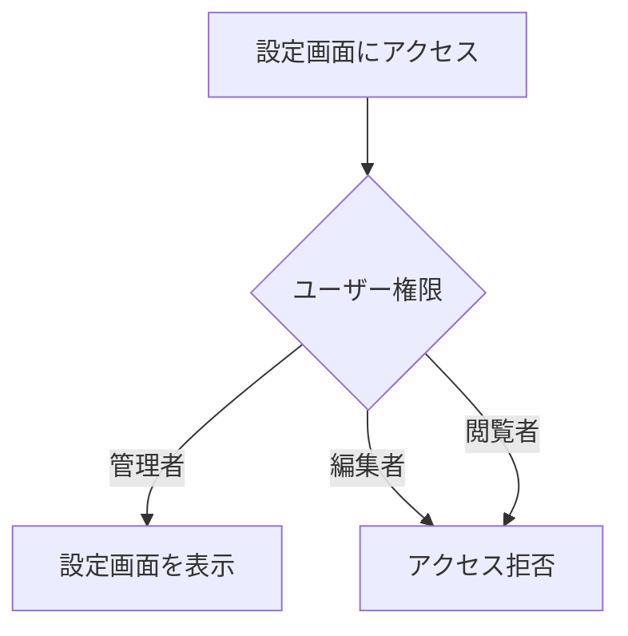
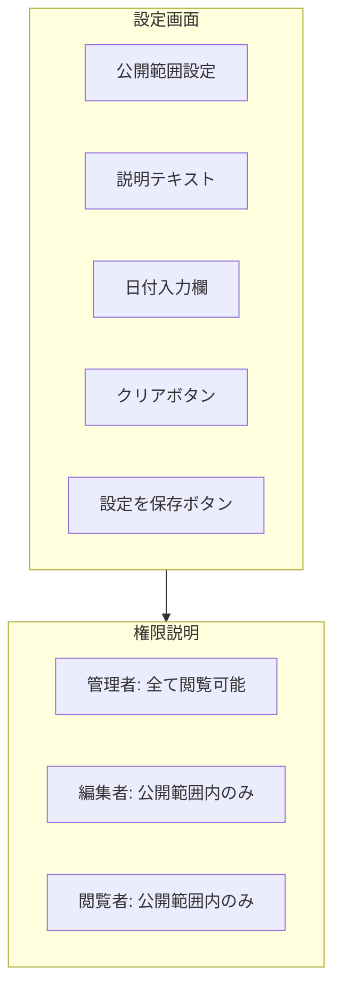
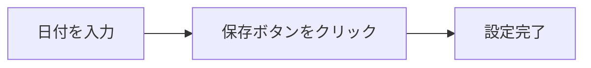
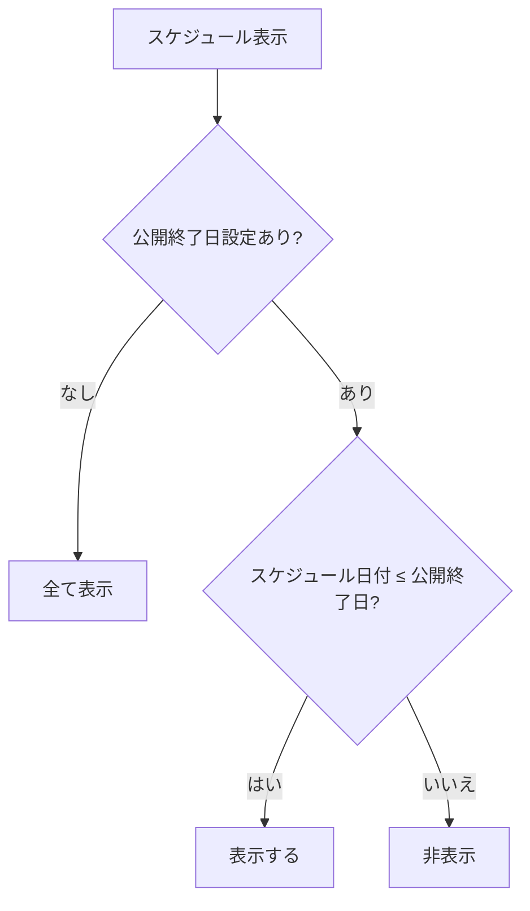

# 設定マニュアル

[← ユーザーマニュアル](./user-manual.md) | [← README](./README.md)

## 関連マニュアル

- [マスタ管理マニュアル](./manual-master.md)
- [スケジュール管理マニュアル](./manual-schedule.md)
- [マイページマニュアル](./manual-mypage.md)

---

## 概要

設定画面では、スケジュールの公開範囲を設定できます。
**この機能は管理者のみが使用できます。**

---

## アクセス権限



| 権限   | アクセス |
| ------ | :------: |
| 管理者 |    ○     |
| 編集者 |    ×     |
| 閲覧者 |    ×     |

---

## 公開範囲設定

### この機能について

公開範囲設定は、スケジュールの表示範囲を制限する機能です。
設定した日付より先のスケジュールは、管理者以外のユーザーには非表示になります。

### 使用例

| シナリオ                               | 設定                         |
| -------------------------------------- | ---------------------------- |
| 来月末までのスケジュールのみ公開したい | 公開終了日を来月末に設定     |
| すべてのスケジュールを公開したい       | 公開終了日をクリア（未設定） |
| 確定していない予定を隠したい           | 確定日までを公開終了日に設定 |

---

## 画面構成



---

## 公開終了日の設定方法

### 操作手順



1. 「スケジュール公開終了日」の日付入力欄をクリック
2. カレンダーから日付を選択（または直接入力）
3. 「**設定を保存**」ボタンをクリック
4. 「保存しました」というメッセージが表示されれば完了

### 入力形式

日付は以下の形式で入力してください：

```
YYYY-MM-DD（例: 2024-03-31）
```

---

## 公開終了日のクリア方法

公開終了日をクリアすると、すべてのスケジュールが全ユーザーに表示されます。

### 操作手順

1. 「**クリア**」ボタンをクリック
2. 確認ダイアログで「OK」をクリック
3. 「クリアしました」というメッセージが表示されれば完了

---

## 公開範囲の動作

### 管理者の場合

公開範囲設定に関係なく、**すべてのスケジュールを閲覧**できます。

### 編集者・閲覧者の場合



| 条件                          |    表示    |
| ----------------------------- | :--------: |
| 公開終了日が設定されていない  | すべて表示 |
| スケジュール日付 ≤ 公開終了日 |    表示    |
| スケジュール日付 > 公開終了日 |   非表示   |

---

## 設定例

### 例1: 今月末まで公開

「来月以降の予定はまだ確定していないので、今月末までのスケジュールのみ公開したい」

1. 公開終了日に「今月末日」を入力（例: `2024-01-31`）
2. 「設定を保存」をクリック

**結果:**

- 管理者: 全てのスケジュールを閲覧可能
- 編集者・閲覧者: 1月31日までのスケジュールのみ閲覧可能

### 例2: 3ヶ月先まで公開

「3ヶ月先までは予定が確定しているので公開したい」

1. 公開終了日に「3ヶ月後の末日」を入力（例: `2024-03-31`）
2. 「設定を保存」をクリック

**結果:**

- 管理者: 全てのスケジュールを閲覧可能
- 編集者・閲覧者: 3月31日までのスケジュールのみ閲覧可能

### 例3: すべて公開

「すべてのスケジュールを公開したい」

1. 「クリア」ボタンをクリック
2. 確認ダイアログで「OK」

**結果:**

- 全ユーザー: 全てのスケジュールを閲覧可能

---

## よくある質問

### Q. 公開終了日を設定したのに、編集者がすべてのスケジュールを見れている

編集者は「スケジュール管理画面」でスケジュールを編集できますが、
公開範囲設定が正しく適用されているか確認してください。
なお、公開範囲は主にマイページでの表示に影響します。

### Q. 公開終了日を過去に設定するとどうなる？

過去の日付を設定した場合、編集者・閲覧者は現在のスケジュールを見ることができなくなります。
通常は将来の日付を設定してください。

### Q. 設定を間違えた

「クリア」ボタンで設定を解除するか、正しい日付を入力し直して保存してください。

---

## 権限一覧（再掲）

| 権限   | スケジュール閲覧 | スケジュール編集 | 設定変更 |
| ------ | :--------------: | :--------------: | :------: |
| 管理者 |       全て       |        ○         |    ○     |
| 編集者 |    公開範囲内    |        ○         |    ×     |
| 閲覧者 |    公開範囲内    |        ×         |    ×     |

---

## アクセス方法

### URL

```
/sanshoTourist/settings
```

### ナビゲーションから

メニューの「**設定**」をクリック

> ⚠️ 管理者権限がない場合、設定メニューは表示されません。

---

[← マイページマニュアル](./manual-mypage.md) | [ユーザーマニュアル →](./user-manual.md)
