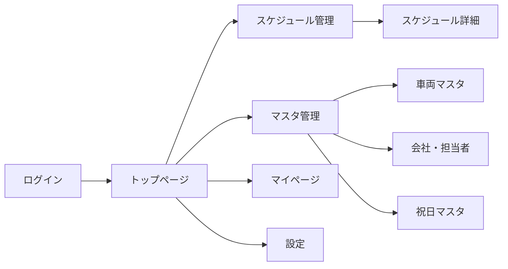
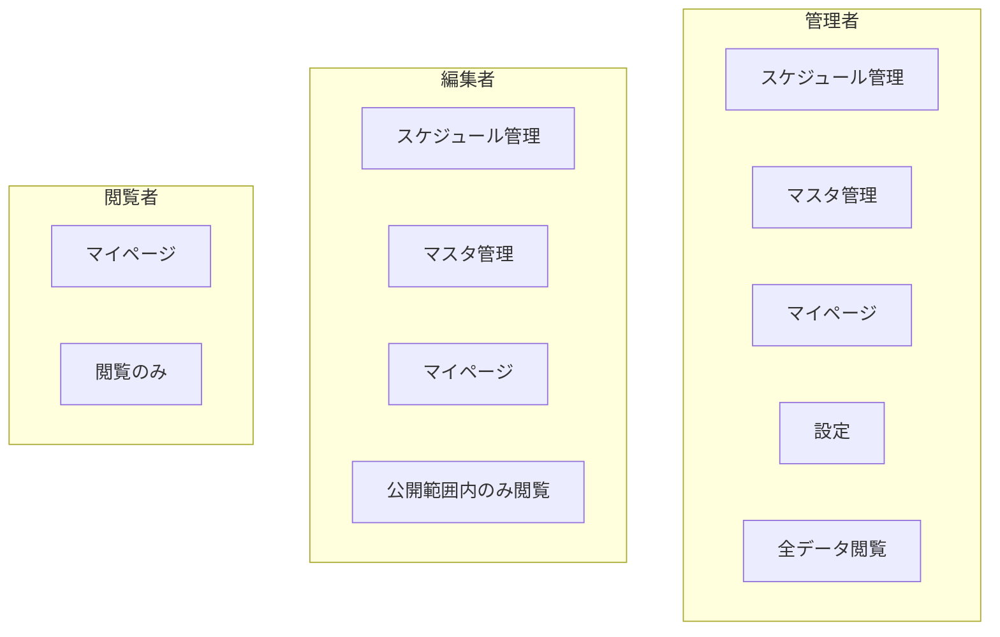

# 観光バス予約管理システム ユーザーマニュアル

[← README に戻る](./README.md)

## 関連マニュアル

- [マスタ管理マニュアル](./manual-master.md) - 車両・会社・担当者・祝日の管理
- [スケジュール管理マニュアル](./manual-schedule.md) - スケジュールの作成・編集・コピー
- [マイページマニュアル](./manual-mypage.md) - 自分のスケジュール確認
- [設定マニュアル](./manual-settings.md) - 公開範囲設定

---

## はじめに

本システムは、観光バスの予約・車両・乗務員のスケジュールを一元管理する Web アプリケーションです。
ガントチャート形式のスケジュール表を使って、効率的な配車管理を行うことができます。

---

## システム画面一覧



---

## ログイン方法

### 1. ログイン画面にアクセス

ブラウザで以下の URL にアクセスしてください。

```
https://[サイトURL]/login
```

### 2. ログイン情報を入力

| 項目           | 説明                               |
| -------------- | ---------------------------------- |
| メールアドレス | 管理者から発行されたメールアドレス |
| パスワード     | 管理者から発行されたパスワード     |

### 3. ログインボタンをクリック

正しい情報を入力後、「ログイン」ボタンをクリックしてください。

---

## 基本的な画面構成

### ヘッダー

画面上部に常に表示されます。

- **アプリロゴ**: クリックするとトップページに移動
- **ナビゲーション**: 各機能へのリンク
- **ユーザー情報**: ログインユーザー名とログアウトボタン

### メインコンテンツ

画面中央に各機能の内容が表示されます。

---

## 権限について

ユーザーには以下の 3 種類の権限があります。
利用できる機能は権限によって異なります。

### 権限別機能一覧



| 機能                   | 管理者 |     編集者      |     閲覧者      |
| ---------------------- | :----: | :-------------: | :-------------: |
| スケジュール閲覧       |   ○    | ○（公開範囲内） | ○（公開範囲内） |
| スケジュール作成・編集 |   ○    |        ○        |        ×        |
| スケジュール削除       |   ○    |        ○        |        ×        |
| マスタ閲覧             |   ○    |        ○        |        ×        |
| マスタ作成・編集・削除 |   ○    |        ○        |        ×        |
| マイページ             |   ○    |        ○        |        ○        |
| 公開範囲設定           |   ○    |        ×        |        ×        |

---

## 各機能へのアクセス

### スケジュール管理

ナビゲーションから「スケジュール」をクリック

**URL:** `/sanshoTourist/schedule`

→ [スケジュール管理マニュアル](./manual-schedule.md)

### マスタ管理

ナビゲーションから「マスタ」をクリック

**URL:** `/sanshoTourist/master`

→ [マスタ管理マニュアル](./manual-master.md)

### マイページ

ナビゲーションから「マイページ」をクリック

**URL:** `/sanshoTourist/myPage`

→ [マイページマニュアル](./manual-mypage.md)

### 設定（管理者のみ）

ナビゲーションから「設定」をクリック

**URL:** `/sanshoTourist/settings`

→ [設定マニュアル](./manual-settings.md)

---

## よくある質問（FAQ）

### Q1. パスワードを忘れました

管理者に連絡して、パスワードをリセットしてもらってください。

### Q2. 自分のスケジュールが表示されません

以下を確認してください：

1. 正しいユーザーでログインしているか
2. 公開範囲設定により、将来のスケジュールが非表示になっていないか
3. 自分がスケジュールの乗務員として登録されているか

### Q3. スケジュールを編集できません

閲覧者権限の場合、スケジュールの編集はできません。
編集が必要な場合は、管理者に連絡してください。

### Q4. 画面が正しく表示されません

以下を試してください：

1. ブラウザを最新版に更新
2. キャッシュをクリア（Ctrl+F5 または Cmd+Shift+R）
3. 別のブラウザで試す

### Q5. データを間違えて削除してしまいました

スケジュールデータは「論理削除」されています。
管理者に連絡すれば、復元できる場合があります。

---

## トラブルシューティング

### エラーが表示される場合

1. 画面をリロード（F5 キー）
2. ログアウトして再ログイン
3. それでも解決しない場合は管理者に連絡

### データが保存されない場合

1. インターネット接続を確認
2. 必須項目がすべて入力されているか確認
3. 画面に表示されるエラーメッセージを確認

### 画面が遅い場合

1. ブラウザのタブを閉じて開き直す
2. 他のアプリケーションを終了
3. インターネット接続を確認

---

## お問い合わせ

システムに関するお問い合わせは、管理者までご連絡ください。

---

[← README に戻る](./README.md) | [マスタ管理マニュアル →](./manual-master.md)
